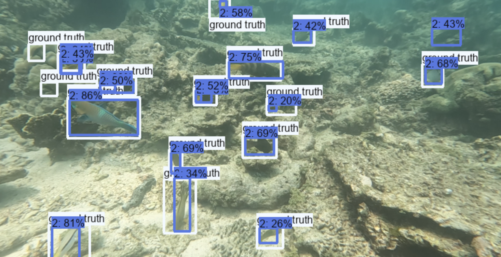
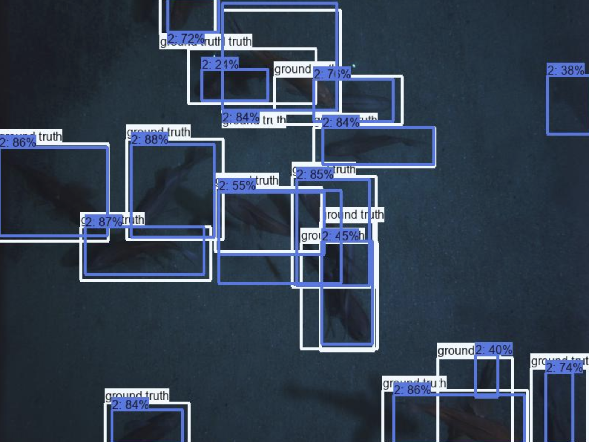
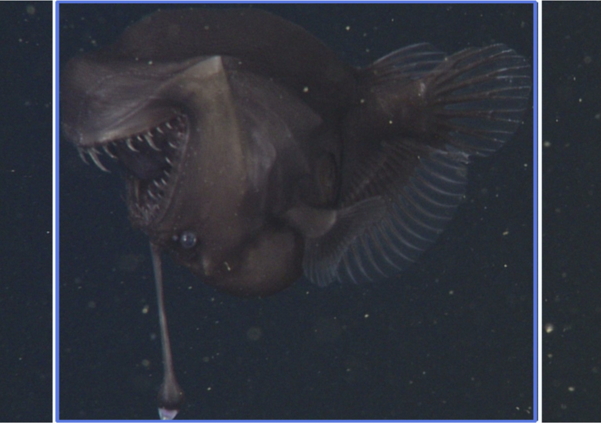
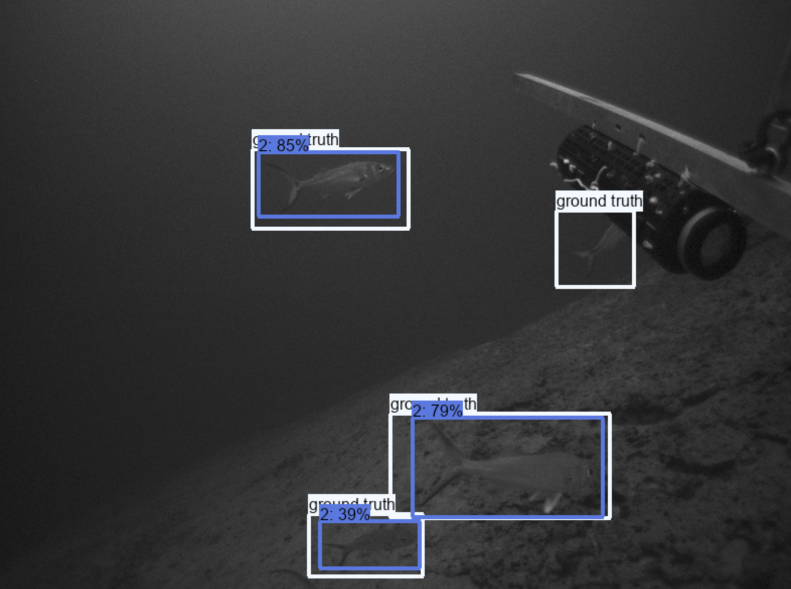
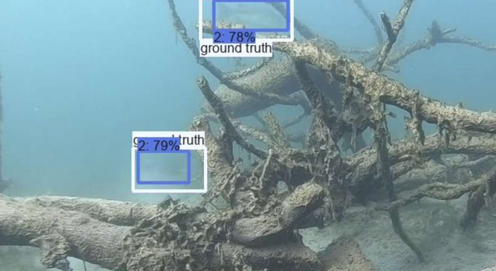
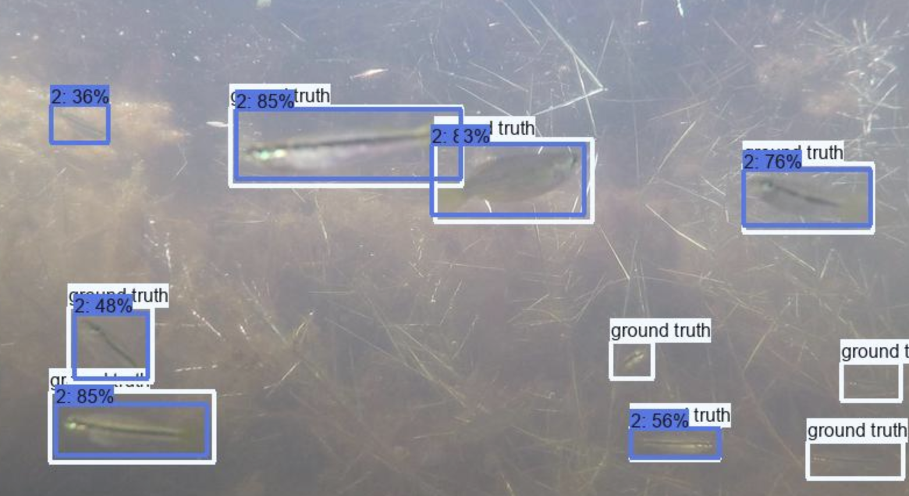
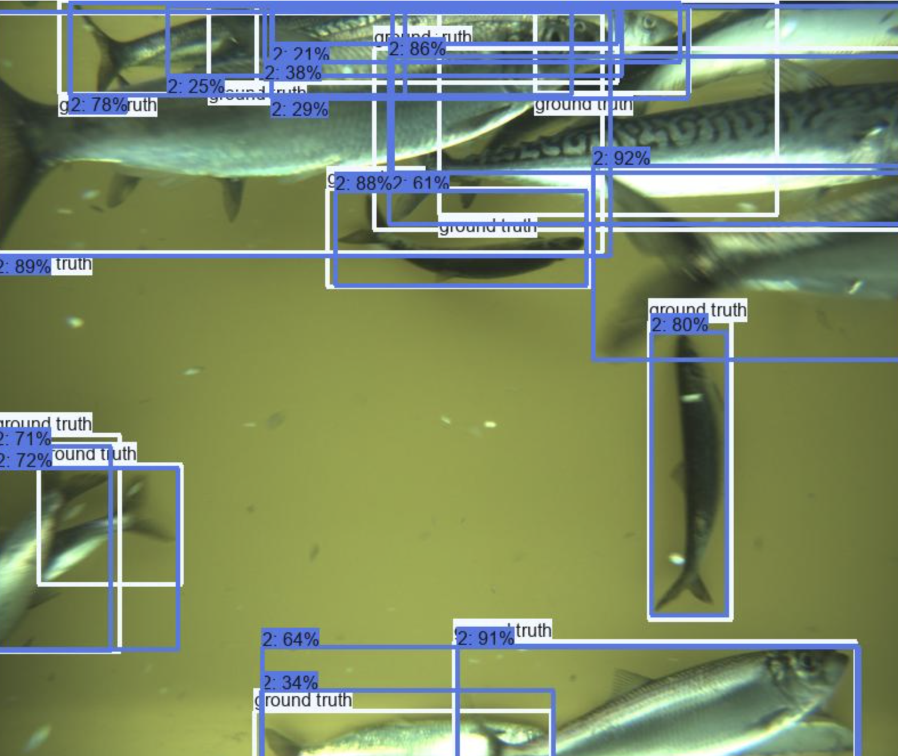

# Community Fish Detector (CFD)

This repository provides pretrained object detection models for identifying one class: “fish.”

The model was trained on the [Community Fish Detection Dataset]([url](https://lila.science/datasets/community-fish-detection-dataset/)), a collaboratively built, large-scale dataset that unifies >1.9 million images and >935,000 fish bounding boxes from 17 open datasets spanning freshwater, marine, and lab environments.

With this project, our goal is to detect any fish, anywhere. 

These models represent an initial training effort. They perform reasonably well across a variety of environments but can certainly be improved. If you’d like to contribute improvements or new experiments, [please get in touch](mailto:fppvrn@gmail.com)!

## Table of Contents
1. [Models Overview](#models-overview)  
2. [Quick Start](#quick-start)  
3. [Contributors](#contributors)
4. [Example Predictions](#example-predictions)  

## Models Overview
| File Name | Architecture | Size | Input Image Size | Target Classes | Dataset | License |
|--|--|--|--|--|--|--|
| cfd_yolov12x.pt | YOLOv12 | `x` | 1024 |  1 (fish) | [Community Fish Detection Dataset]([url](https://lila.science/datasets/community-fish-detection-dataset/)) | CC-BY |

## Quick Start
### 1. Clone the repo
```bash
git clone https://github.com/WildHackers/community-fish-detector.git
cd community-fish-detector
```
### 2. Install Dependencies
```bash
pip install ultralytics
```
### 3. Run Inference
```python
from ultralytics import YOLO

# Load model
model = YOLO("cfd_yolov12x.pt")

# Run on an image or folder
results = model.predict(source="path/to/images_or_videos", imgsz=1024)

# Visualize results
results[0].show()
```
⚠️ Remember to set the image size `imgsz=1024`

## Contributors
This model was created by a collective effort of the following folks: <a href="https://www.linkedin.com/in/filippo-varini/">Filippo Varini</a>, <a href="https://dmorris.net">Dan Morris</a>, , <a href="https://www.linkedin.com/in/sonny-burniston/">Sonny Burniston</a>, <a href="https://www.oceaneboulais.net/">Oceane Boulais</a>, <a href="https://www.mbari.org/person/kevin-barnard/">Kevin Barnard</a>, <a href="https://www.mbari.org/person/laura-chrobak/">Laura Chrobak</a>, <a href="https://alexvmt.github.io/">Alexander Merdian-Tarko</a>, <a href="https://www.linkedin.com/in/kameswari-devi-ayyagari-031820b7/">Devi Ayyagari</a>, <a href="https://www.linkedin.com/in/mona-dhiflaoui/">Mona Dhiflaoui</a>, <a href="https://www.linkedin.com/in/jiashu-chen-w/">Joshua Chen</a> and many others.

If you don't see your name, please [email us](mailto:fppvrn@gmail.com)!

We **welcome further contributions!**
If you:
- Have a dataset that could expand coverage,
- Want to contribute to improving the model,

please [reach out](mailto:fppvrn@gmail.com)!

## Example Predictions
Below we want to provide some move visual examples that overlay the ground truth with the model detections, to give you a qualitative sense of the model's performance.







